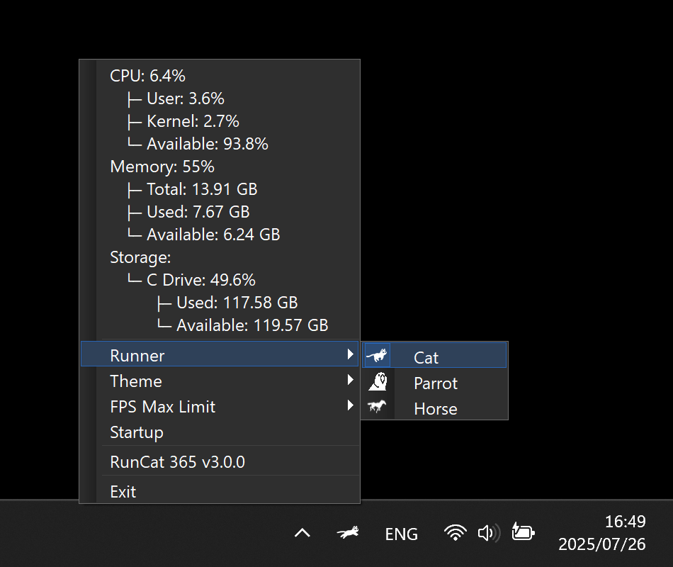

# RunCat 365

**A cute running cat animation on your Windows Taskbar.**

> [!CAUTION]
>
> - This project is for Windows, so we do not accept inquiries about macOS version.
> - We do not accept issues or pull requests in languages other than English.

> [!NOTE]
>
> I'm currently preparing to distribute the app on the Microsoft Store,
> so please do not post questions about how to download it for issues.

`C#` `.NET 9.0` `Visual Studio` `RunCat`

## Demo

 

## Installation

Comming Soon.

## Contributors

